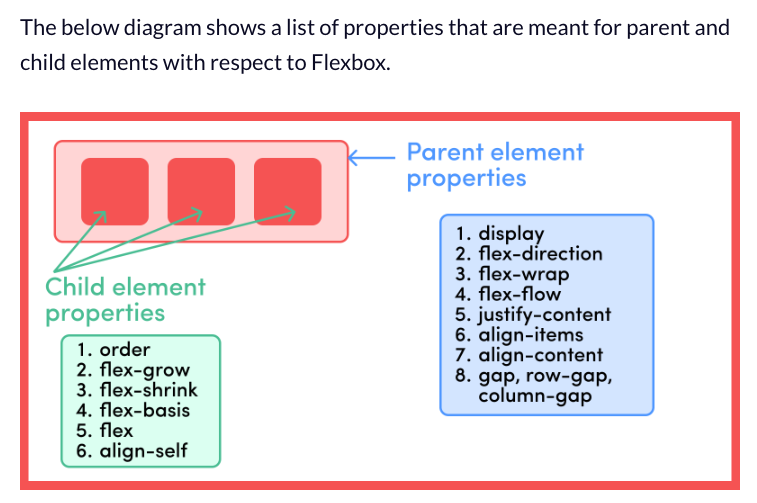
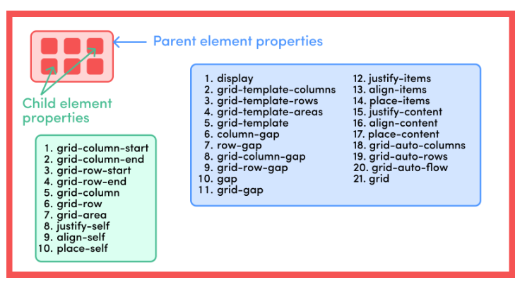

# Curso de CSS

## Como centrar un DIV

> Forma 1

```tsx
#parentContainer {
  width: 400px;
  height: 400px;
  position: relative;
}
#childContainer {
  position: absolute;
  top: 50%;
  left: 50%;
  transform: translate(-50%, -50%);
}
```
> Forma 2
```tsx
Mateniendo #parentControl en position: absolute

#childContainer {
  position: absolute;
  top: 0;
  left: 0;
  bottom: 0;
  right: 0;
  margin: auto;
}
```
> Forma 3 - Usando flex-box



```tsx
#parentContainer {
  display: flex;
  justify-content: center;
  align-items: center;
}
```
> Forma 4
```tsx
#parentContainer {
    display: flex;
    justify-content: center;
}
#childContainer {
    align-self: center;
}
```
> Forma 5 - Flexbox y margin:auto

```tsx
#parentContainer {
    display: flex;
}
#childContainer {
    margin: auto;
}
```
> Forma 6 - Como centrar un div usando CSS Grid

Propiedades de los grid:



```tsx
#parentContainer {
  display: grid;
  justify-content: center;
  align-items: center;
}
```
> Forma 7 - Como usar Grid y place-items

```tsx
#parentContainer {
  display: grid;
  place-items: center;
}
```


